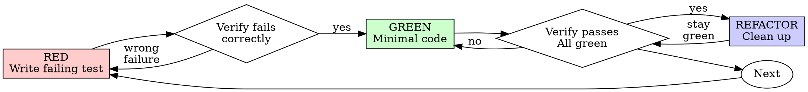

# sdlc-evolve — TDD discipline for changes (v4.0, proxy)

## SDLC integration

- **When to invoke**: during `/sdlc:dev`, when starting any P### that
  changes production code (feature, bug fix, refactor), and while writing
  the matching T### in `4_tests.md`.
- **Scope — SDLC TDD doctrine (this skill is authoritative)**: TDD is
  required (RED first) for **production code**; optional for **mechanical**
  P### (config, scaffolding, generated code, throwaway prototype).
  `sdlc-lang-dispatcher` (cross-cutting standard #5) follows this scope, so
  dev subagents receive a single doctrine.
- **Place in the pipeline**: between writing the P### (`3_conception.md`)
  and implementing it. The T### are written before the code.
- **Expected deliverable**: for each P###, at least one T### that fails
  (red) before the production code and passes (green) after. Record it in
  `4_tests.md`, "initial state" → "final state" column.

> **Proxy status** — adapted from `test-driven-development`
> ([obra/superpowers](https://github.com/obra/superpowers)) because no
> dedicated evolution / refactor skill exists there. It covers
> test-driven incremental improvement, not *structural* refactors
> (extract-class, move-module, …). Replace it if a dedicated `evolve` or
> `refactor` skill appears.

---

# Test-Driven Development (TDD)

## Overview

Write the test first. Watch it fail. Write the minimal code that makes it pass.

Core principle: if you didn't watch the test fail, you don't know whether it tests the right thing.

## When to use

Use it for:
- New features
- Bug fixes
- Refactoring
- Behavior changes

Exceptions (confirm with the user):
- Throwaway prototypes
- Generated code
- Configuration files

## The rule

```
No production code without a failing test first.
```

If you wrote production code before its test, set that code aside and
re-implement it from the test. Don't keep it as a reference or adapt it
while writing the test: a test shaped around existing code only confirms
what was built, not what was required.

## Red-Green-Refactor



### RED — write a failing test

Write one minimal test showing what should happen.

<Good>
```typescript
test('retries failed operations 3 times', async () => {
  let attempts = 0;
  const operation = () => {
    attempts++;
    if (attempts < 3) throw new Error('fail');
    return 'success';
  };

  const result = await retryOperation(operation);

  expect(result).toBe('success');
  expect(attempts).toBe(3);
});
```
Clear name, tests real behavior, one thing
</Good>

<Bad>
```typescript
test('retry works', async () => {
  const mock = jest.fn()
    .mockRejectedValueOnce(new Error())
    .mockRejectedValueOnce(new Error())
    .mockResolvedValueOnce('success');
  await retryOperation(mock);
  expect(mock).toHaveBeenCalledTimes(3);
});
```
Vague name, tests the mock rather than the code
</Bad>

Requirements:
- One behavior
- Clear name
- Real code (mocks only when unavoidable)

### Verify RED — watch it fail

Always run it; this is the step that proves the test can detect the missing behavior.

```bash
npm test path/to/test.test.ts
```

Confirm:
- The test fails (rather than erroring)
- The failure message is the expected one
- It fails because the feature is missing, not because of a typo

Test passes? It is testing existing behavior; fix the test.

Test errors? Fix the error and re-run until it fails for the right reason.

### GREEN — minimal code

Write the simplest code that passes the test.

<Good>
```typescript
async function retryOperation<T>(fn: () => Promise<T>): Promise<T> {
  for (let i = 0; i < 3; i++) {
    try {
      return await fn();
    } catch (e) {
      if (i === 2) throw e;
    }
  }
  throw new Error('unreachable');
}
```
Just enough to pass
</Good>

<Bad>
```typescript
async function retryOperation<T>(
  fn: () => Promise<T>,
  options?: {
    maxRetries?: number;
    backoff?: 'linear' | 'exponential';
    onRetry?: (attempt: number) => void;
  }
): Promise<T> {
  // YAGNI
}
```
Over-engineered
</Bad>

Don't add features, refactor other code, or "improve" beyond what the test requires.

### Verify GREEN — watch it pass

Run the tests and read the output.

```bash
npm test path/to/test.test.ts
```

Confirm:
- The test passes
- Other tests still pass
- The output is clean (no errors, no warnings)

Test fails? Fix the code, not the test.

Other tests fail? Fix them now, before moving on.

### REFACTOR — clean up

Only once green:
- Remove duplication
- Improve names
- Extract helpers

Keep the tests green. Don't add behavior.

### Repeat

Next failing test for the next behavior.

## Good tests

| Quality | Good | Bad |
|---------|------|-----|
| **Minimal** | One thing. "and" in the name? Split it. | `test('validates email and domain and whitespace')` |
| **Clear** | Name describes the behavior | `test('test1')` |
| **Shows intent** | Demonstrates the desired API | Obscures what the code should do |

## Why the order matters

**"I'll write tests afterwards to check it works."**
Tests written after the code pass immediately, which proves nothing: they may test the wrong thing, test the implementation instead of the behavior, or miss edge cases you forgot. You never saw them catch the bug. Test-first makes you see the failure, which shows the test actually tests something.

**"I already tested the edge cases manually."**
Manual testing leaves no record, can't be re-run when the code changes, and is easy to cut short under pressure. Automated tests run the same way every time.

**"Rewriting hours of work is wasteful."**
That time is spent either way. The real cost is keeping code you can't trust; working code without real tests is technical debt.

**"TDD is dogmatic; being pragmatic means adapting."**
TDD is the pragmatic option: it finds bugs before commit, catches regressions immediately, documents behavior, and makes refactoring safe.

**"Tests after achieve the same goals."**
Tests-after answer "what does this do?"; tests-first answer "what should this do?". Tests-after are biased by the implementation — you verify the edge cases you remembered rather than discover the ones you missed.

## Common rationalizations

| Excuse | Reality |
|--------|---------|
| "Too simple to test" | Simple code breaks too, and the test takes seconds. |
| "I'll test after" | Tests that pass immediately prove nothing. |
| "Already tested manually" | No record, can't re-run. |
| "Keep it as a reference while writing tests" | You'll adapt it, which is testing after. |
| "Need to explore first" | Fine — treat the exploration as throwaway, then start with TDD. |
| "Hard to test" | Hard to test usually means hard to use; simplify the design. |
| "Existing code has no tests" | You're changing it, so add tests for the part you touch. |

Warning signs that TDD was skipped: code written before its test, a test that passes on first run, a failure you can't explain, tests deferred to "later", or "this case is different because…". When you notice one, go back to RED.

## Example: bug fix

**Bug:** empty email accepted

**RED**
```typescript
test('rejects empty email', async () => {
  const result = await submitForm({ email: '' });
  expect(result.error).toBe('Email required');
});
```

**Verify RED**
```bash
$ npm test
FAIL: expected 'Email required', got undefined
```

**GREEN**
```typescript
function submitForm(data: FormData) {
  if (!data.email?.trim()) {
    return { error: 'Email required' };
  }
  // ...
}
```

**Verify GREEN**
```bash
$ npm test
PASS
```

**REFACTOR**
Extract validation for multiple fields if needed.

## Checklist before marking the P### done

- [ ] Every new function/method has a test
- [ ] Each test was seen failing before implementation
- [ ] Each test failed for the expected reason (feature missing, not a typo)
- [ ] Minimal code written to pass each test
- [ ] All tests pass
- [ ] Output clean (no errors, no warnings)
- [ ] Tests use real code (mocks only if unavoidable)
- [ ] Edge cases and errors covered

If a box can't be checked, the cycle was skipped for that part; go back to RED for it.

## When stuck

| Problem | Solution |
|---------|----------|
| Don't know how to test it | Write the API you wish you had; write the assertion first. Ask the user. |
| Test too complicated | The design is too complicated; simplify the interface. |
| Must mock everything | The code is too coupled; use dependency injection. |
| Huge test setup | Extract helpers. Still complex? Simplify the design. |

## Debugging integration

Found a bug? Write a failing test that reproduces it, then follow the cycle. The test proves the fix and prevents a regression. Fix bugs with a test, always (see `sdlc-debugger` for finding the root cause).

## Testing anti-patterns

When adding mocks or test utilities, read @testing-anti-patterns.md. It covers:
- Testing mock behavior instead of real behavior
- Adding test-only methods to production classes
- Mocking without understanding dependencies

## Final rule

```
Production code → a test exists and failed first
Otherwise → not TDD
```

Exceptions only with the user's agreement.
